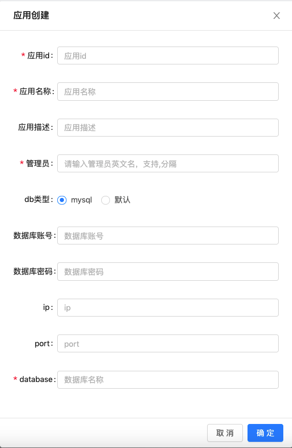
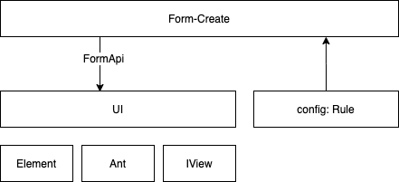
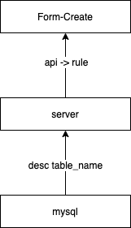
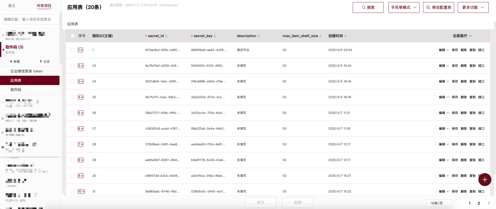

# 动态表单/表格

## 1 石器时代

### 1.1 表单组件现状

先来看看传统的 Form 组件是怎么构建的

应用创建表单 - 视图



应用创建 - 代码

```html
<a-form :layout="formLayout">
  <!-- 应用id -->
  <a-form-item
    label="应用id"
    :label-col="formItemLayout.labelCol"
    :wrapper-col="formItemLayout.wrapperCol"
  >
    <a-input placeholder="应用id" v-decorator="[
      'appId',
      { rules: [
        { required: true, message: '必填项' },
        { pattern: /^\w+$/, message: '只能为字母、数字和下划线_' }
      ] },
    ]"/>
  </a-form-item>
  <!-- 应用名称 -->
  ...
</a-form>
```

每增加一个表单，都需要粘贴一份基本相同的模板，这里会有两个问题：

1. 过度依赖 UI 模版，增加维护成本，如果遇到组件库升级，改动成本大
2. 样板代码很多

### 1.2 表单组件雏形

1. 抽象为配置文件

```js
const APP_FORM_RULE = [
  {
    type: 'input',
    field: 'appid',
    title: '应用id',
    props: {
      placeholder: '应用id'
    },
    validate: [
      { required: true, message: '必填项' },
      { pattern: /^\w+$/, message: '只能为字母、数字和下划线_' }
    ]
  },
  {
    type: 'input',
    field: 'name',
    title: '应用名称',
    props: {
      placeholder: '应用名称'
    },
    validate: [{ required: true, message: '必填项' }]
  }
]
```

2. 配置渲染组件

```html
<!-- <TksForm /> 组件 -->
<template>
	<a-form :form="form">
    <template v-for="field in fields">
      <a-form-item
        :label="field.description"
        :key="field.name"
        :labelCol="labelCol"
        :wrapdperCol="wrapperCol"
      >
        <!-- 单选组件 -->
        <a-radio-group
          v-if="field.type === 'radio-group'"
          v-decorator="[field.name, {rules: field.rules, initialValue: field.initialValue}]"
        >
          <a-radio-button v-for="radio in field.radios" :value="radio.value" :key="radio.description">
            {{ radio.description }}
          </a-radio-button>
        </a-radio-group>
        <TksSelect
          ref="select"
          v-else-if="field.type === 'select'"
          v-decorator="[field.name, {rules: field.rules}]"
          :disabled="field.disabled"
          :loadPromise="field.loadPromise"
          :valueField="field.valueField"
          :keyField="field.keyField"
          :optionField="field.optionField"
          :lazy="field.lazy"
        />
        <!-- 日期组件 -->
        <a-month-picker
          v-else-if="field.type === 'month-picker'"
          v-decorator="[field.name, {rules: field.rules}]"
          :disabled="field.disabled"
          :format="field.format"
        />
				...
      </a-form-item>
    </template>
	<a-form>
</template>
<script>
export default {
  props: {
    field: {
      type: Array,
      required: true
    }
  }
}
</script>
```

3. 使用

```html
<TksForm ref="form" fields={APP_FORM_RULE} />
```


看起来循环生成的方式不是很优雅，但是的确是解决了一些问题：

1. 减少样板代码
2. 配置和 UI 层解除耦合

但是，如你所见，这种表单渲染的局限性太大了，可拓展性基本上为 0 的

## 2 工业时代

### 2.1 动态表单 Form-create

- 支持三种UI框架

- 支持表单组件/自定义组件的生成

- 支持局部更新

  避免配置更新，For 循环重新执行，造成不必要的渲染

- 支持栅格布局

- 表单联动

[Form-Create 示例](http://www.form-create.com/v2/guide/demo.html)

> react: https://formilyjs.org/#/bdCRC5/dzUZU8il

### 2.2 使用 Form-Create 重构

1. 引入 Form-create

```js
import FormCreate from '@form-create/ant-design-vue'

Vue.use(FormCreate)
```

2. 使用 Form-create 创建表单

```js
const DynamicForm = {
  data() {
    return {
      formInstance: {},
      option: {
        submitBtn: { show: false }
      },
      rule: APP_FORM_RULE
    }
  },
  methods: {
    submit () {
      return new Promise((resolve, reject) => {
        this.formInstance.submit(resolve, reject)
      })
    },
    resetFields (...args) {
      return this.formInstance.resetFields(...args)
    }
  },
  render() {
    const assign = {
      props: {
        rule: this.rule,
        value: this.formInstance,
        option: this.option
      },
      on: {
        // init
        input: formInstance => (this.formInstance = formInstance)
      }
    }
    return <FormCreate {...assign} />
  }
}
```

3. 常用接口演示

```js
// 提交表单
formInstance.submit
// 重置表单
formInstance.resetFields
// 更新配置
formInstance.updateRule
// 批量更新配置
formInstance.updateRules
// 重载
formInstance.reload(Rules)
```



## 3 更进一步

通过上面的重构，我们发现最终的工作量落在了配置 rule 上，那么这一部分的工作量还有可能在减少吗？

对于一个后台表的增删改查来说，基本上是一个字段不差的都需要渲染，这些表结构在mysql中都是可以获取到的

### 3.1 获取表结构

如下所示，我们能通过查看 mysql 表结构获取到全部字段：

```sh
MySQL [fileshelf]> desc application;
+---------------------+-------------+------+-----+----------------------+----------------+
| Field               | Type        | Null | Key | Default              | Extra          |
+---------------------+-------------+------+-----+----------------------+----------------+
| secret_id           | text        | NO   |     | NULL                 |                |
| secret_key          | text        | NO   |     | NULL                 |                |
| _ctime              | datetime(6) | NO   |     | CURRENT_TIMESTAMP(6) |                |
| _mtime              | datetime(6) | NO   |     | CURRENT_TIMESTAMP(6) |                |
| _id                 | int(11)     | NO   | PRI | NULL                 | auto_increment |
| description         | text        | NO   |     | NULL                 |                |
| max_item_shelf_size | int(11)     | NO   |     | 50                   |                |
+---------------------+-------------+------+-----+----------------------+----------------+
7 rows in set (0.04 sec)
```

如果后台能提供获取表结构的接口，我们在渲染表单之前先发起请求获取所有字段，然后将字段转换为 form-create 的 rule ，那么表单就可以自动渲染出来：



### 3.2 配置平台

内部有个自研的配置平台，在这个平台上创建的表自动赋予增删改查的 restful 接口，并且也提供了每个表的表结构获取接口



获取表结构接口示例：

```json
// GET /api/field?_appid=fileshelf&_schemaid=application
{
  "data": [
    {
      "id": "platform_id",
      "name": "平台id",
      "desc": "",
      "type": 1,
      "required": false,
      "args": "",
      "maxlength": "",
      "pattern": "",
      "sort": "",
      "readonly": false,
      "score": 19
    },
    {
      "id": "platform_name",
      "name": "平台名称",
      "desc": "",
      "type": 1,
      "required": false,
      "args": "",
      "maxlength": "",
      "pattern": "",
      "sort": "",
      "readonly": false,
      "score": 18
    },
  ]
}
```

### 3.2 能力整合


### 3.3 使用 ConfForm 进行重构

```html
<ConfFormView
  appId={appId}
  schemaId={schemaId}
  on={formListener}
/>
```

### 3.4 动态表格

同样的思路应用在表格组件

```html
<ConfTableView
  appId={this.appId}
  schemaId={this.schemaId}
  on={tableListener}
  rowSelection={this.rowSelection}
/>
```

### 3.5 示例


