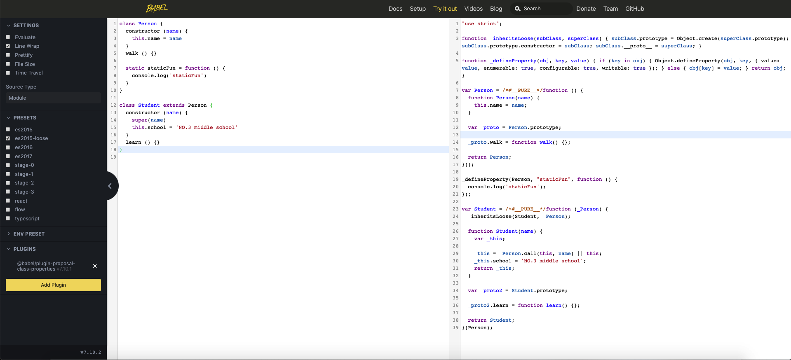

# ES6与ES5的类继承机制

## 概述

在面试或者浏览技术网站时，经常会遇到这样一个问题：ES6 和 ES5 的继承机制有哪些不同 ? 本文章带你深入了解 ES6 和 ES5 继承的原理。

## 原型链

聊 js 的继承，肯定是绕不开原型链，我们先来复习一下 js 的原型链：

```js
('').__proto__ === String.prototype // true
({}).__proto__ === Object.prototype // true
Object.prototype.__prototype === null // true
function Person () {}
Person.__proto__ === Function.prototype // true
(new Person).__proto__ === Person.prototype // true
(class {}).__proto__ === Function.prototype // true
```

从这里我们可以看出，字符串、对象、函数等内置一些方法是因为原型链 `__proto__` 指向了相应的构造函数的原型 `prototype` ，从而继承了原型上的方法。 在 Javascript 中也是通过原型链来实现继承，先说 es6的 class

## ES 6 class

```js
class Person {
  constructor (name) {
    this.name = name
  }
  walk () {}
  // 静态属性
  static staticFun = function () {
  	console.log('staticFun')
  }
}
class Student extends Person {
  constructor (name) {
    super(name)
    this.school = 'NO.3 middle school'
  }
  learn () {}
}

const ming = new Student()
ming.learn()
ming.walk()
Student.staticFun()
```

例子中，ming 有 learn 方法是因为，ming 的 `__proto__` 指向 Student 类的原型

```js
ming.__proto__ === Student.prototype // true
```

ming 有 walk 方法是因为 Student 的原型能通过 `__proto__` 连接到父类的原型，能找到父类的 walk 方法

```js
Student.prototype.__proto__ === Person.prototype
ming.__proto__.__proto__ === Person.prototype
```

但是，为什么 Student 为什么继承了 staticFun 方法 ？ Student 通过自己原型的 `__proto__` 去寻找肯定找不到，因为父类的原型上根本就没有这个方法，这个是一个静态的方法。

其实不仅 Student.prototype 有 `__proto__` Student 有自己的 `__proto__` ，而他的原型链指向父类的构造函数：

```js
Student.__proto__ === Person // true
```

这就解释了，Student 类上没有静态函数 staticFun，进而通过原型链向上寻找，发现 Person 类有静态方法 staticFun。

## ES5 的继承

JavaScript 高级程序设计（第三版）提到寄生组合式继承：

```js
function SuperType (name) {
  this.name = name
}
SuperType.staticFun = function () { console.log('staticFun') }
SuperType.prototype.sayName = function () { return this.name }
function SubType (name, age) {
  SuperType.call(this, name)
  this.age = age
}
SubType.prototype = Object.create(SuperType.prototype)
SubType.prototype.constructor = SubType
SubType.prototype.sayAge = function () { return this.age }

const demo = new SubType('ming', 22)
demo.sayAge() // ming
demo.sayName() // 22
SubType.staticFun() // throw TypeError
```

demo 的 sayAge 、sayName 方法正常调用可以预期到：

```js
demo.__proto__ === SubType.prototype // true
SubType.prototype.__proto__ === SuperType.prototype // true
```

那么，为什么 SubType 没有 staticFun 方法呢 ？肯定是 `SubType.__proto__` 没有指向 SuperType ，那指向哪里了呢？

```js
SubType.__proto__ === Function.prototype // true
SuperType.__proto__ === Function.prototype // true
```

还记得文章开始，原型链部分的复习吗？

```js
function Person () {}
Person.__proto__ === Function.prototype // true
```

这里就可以发现，传统的寄生组合式继承方式与 ES6 class 的一个区别，无法自动继承父级的静态方法。

要想实现静态方法的继承也很简单，只需要修改 SubType 的原型链，指向到 SuperType 即可：

```js
SubType.__proto__ = Super // 或者 Object.setPrototypeOf(SubType, SuperType)
SubType.staticFun() // staticFun
```

## 总结

### 两者继承机制不同

ES5 中，子类对于父类构造函数的继承时，子类的 this 已经存在，通过 `SuperType.call(this, ...args)` 的方式来修改子类的 this

而 ES6 的子类必须要调用 `super(...args)` 来生成 this

### 两者构造函数的原型链指向不同

ES5 的子类和父类的构造函数函数的原型链都指向 Function.prototype

而 ES6 的子类的构造函数的原型链指向父类的构造函数

## 附录

贴一张 babel 编译 ES6 class 为 ES5 的图片：




