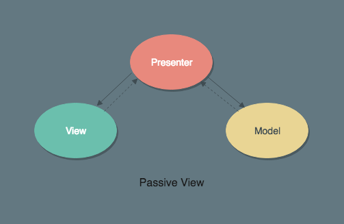
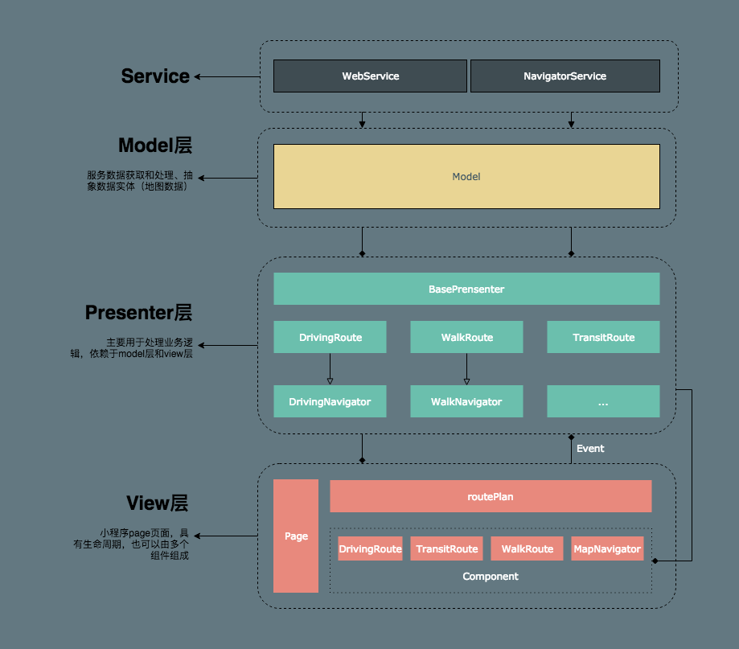

# 前端有必要重启MVC开发模式



如今盛行的 React、Vue 等框架以及微信小程序都会将将视图层和数据层抽离，提供组件化的开发模式，解耦交互逻辑，实现了代码的复用。那么 MVC 在前端领域还有再提及的必要吗？有的，React 只当作自己是 ui render 函数，也就是 MVC 中的 V 了。即使有类似于 redux、vuex 这样状态管理的库，面对交互复杂的业务逻辑也是无能为力的。本文介绍 MVC 的变种 - MVP 设计思想，实践于一个交互复杂的小程序，在此作总结回顾。

## 概述

### MVP 简介

相信大家都了解 MVC 的开发模式，其主要解决视图、数据、业务逻辑耦合度较高；视图、数据模型无法复用；无法进行单元测试，保证代码质量。MVP 是 MVC的延伸，**MVP 与 MVC 的区别在于 Model 层和 View 层的解耦** ，它强调强视图和模型层分离，这样的好处也是显而易见的：Model 的职责更加单一；View 层也更加的“函数式”，与 React 提倡的函数式 UI 组件理念是非常契合的。

### 定位

随着项目的复杂度的提升，以下问题逐渐暴露

1. 视图层没有明确的职责划分，绝大部分业务逻辑会在视图层完成，视图层会变得越来越臃肿
2. 业务逻辑无法复用
3. 视图层和业务逻辑耦合较高，单元测试难度大，覆盖率不高
4. 没有清晰的架构分层

## 实践

### demo

假如产品经理给我们这样一个需求：
- 渲染多个分类 Radio，这些按钮需要写在数据库里，能随时增加减少
- 由于可能存在多个，默认只显示部分，其余部分点击更多展示
- 五秒钟之后没有选择，自动收起

那么我们以 MVP 的思路来书写一下：

#### View 视图层

```jsx
/**
 * title: View
 * desc: 接受 配置、onChange、onShowMore 三个参数
 */
import React from 'react'
import { Radio, Button } from 'antd'
import { EllipsisOutlined } from '@ant-design/icons'

const MOCK_RADIOS = [
  { id: 1, title: '茶水间' },
  { id: 2, title: '文印室' },
  { id: 3, title: '卫生间', hidden: true }
]

export default props => {
  const radioSource = props.radioSource || MOCK_RADIOS
  const handleChange = value => {
    if (value === 'symbol_more') {
      props.onShowMore && props.onShowMore(value)
    } else {
      props.onChange && props.onChange(value)
    }
  }
  const isMoreShow = radioSource.find(item => item.hidden)
  
  return (
    <section>
      <Radio.Group onChange={handleChange}>
        {
          radioSource.map(item =>
            <Radio value={item.id} key={item.id}>{item.title}</Radio>
          )
        }
        { isMoreShow && <Radio value="symbol_more"><EllipsisOutlined /></Radio> }
      </Radio.Group>
    </section>
  )
}
```
#### Model 数据层

```js
class RadioModel {
  static getRadioConf () {
    const MOCK_RADIOS = [
      { id: 1, title: '办公位' },
      { id: 2, title: '健身房' },
      { id: 2, title: '邮件中心' },
      { id: 3, title: '711' }
    ]
    return new RadioConfEntity(MOCK_RADIOS)
  }
}

const DEFAULT_SHOW_SIZE = 3 // 默认展示3个
class RadioConfEntity {
  constructor (source) {
    this.source = source.forEach((radioItem, index) => {
      return {
        ...radioItem,
        selected: false,
        collapse: index >= DEFAULT_SHOW_SIZE
      }
    })
  }

  get (id) { return this.source.find(item => item.id === id) }

  select (id) {
    this.unSelectAll(id)
    const target = this.get(id)
    target && (target.selected = true)
  }

  unSelectAll () { this.source.forEach(item => (item.selected = false)) }

  fold () {
    this.source.forEach((radioItem, index) => {
      if (index >= DEFAULT_SHOW_SIZE) {
        radioItem.collapse = true
      }
    })
  }
  unFold () {
    this.source.forEach(radioItem => (radioItem.collapse = false))
  }
  toJSON () {
    return this.source.filter(radioItem => !radioItem.collapse)
  }
}
```

#### Presenter 业务逻辑层

```js
const DEFAULT_FOLD_INTERVAL = 5000
class RadioViewPresenter {
  constructor (view) {
    this.view = view
    this.radioSource = null
    this.radioEntity = null
    this.debounceFold = debounce(this.radioEntity.bind(this.radioEntity), DEFAULT_FOLD_INTERVAL)
    this.init()
  }

  init () {
    this.radioEntity = RadioModel.getRadioConf()
  }

  onChange = id => {
    this.radioEntity.select(id)
    this.setState({
      radioSouce: this.radioEntity.toJSON()
    })
  }

  onShowMore = () => {
    this.radioEntity.unFold()
    this.setState({
      radioSouce: this.radioEntity.toJSON()
    })
  }

  render () {
    return this.view({
      radioSource: this.radioSource,
      onChange: this.onChange,
      onShowMore: this.onShowMore,
    })
  }
}
```

#### 演示


#### 业务组件层

### 引入实体

### 引入拦截器

### 错误处理

## 总结





