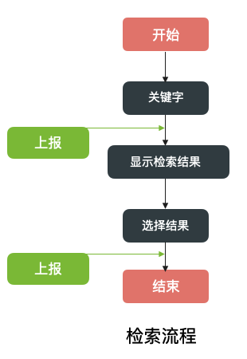
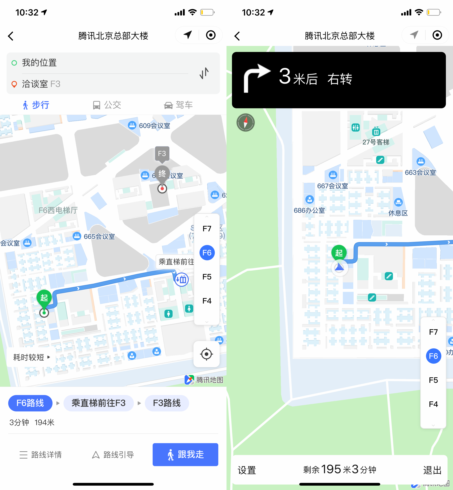

# 我在前端项目中使用了 MVP

如今流行的 React、Vue 等框架以及微信小程序都会将视图层和数据层抽离，提供组件化的开发模式，解耦交互逻辑，实现了代码的复用。那么 MVC 在前端领域还有再提及的必要吗？

有的，React 只当作自己是 ui render 函数，可以看作 MVC 中的 V。本文介绍 MVC 的变种 - MVP 设计思想，实践于一个交互复杂的微信小程序，在此作总结回顾。

## 概述

### MVP 简介


相信大家都了解 MVC 的开发模式，其主要解决视图、数据、业务逻辑耦合度较高；视图、数据模型无法复用；无法进行单元测试，保证代码质量。MVP 是 MVC 的延伸，**MVP 与 MVC 的区别在于 Model 层和 View 层的解耦** ，在 MVC 的基础上，它强调强视图和模型层分离，这样的好处也是显而易见的：Model 的职责更加单一，且不与视图层耦合；View 层也更加的“函数式”，减少因与模型层耦合带来的副作用，更加利于组件化。

> 如果对 MVC、MVP、MVVM 概念还有模糊的同学，可以参考 [浅谈 MVC、MVP 和 MVVM 架构模式](https://draveness.me/mvx/)

### 背景

前端应用随着项目的复杂度的提升，以下问题逐渐暴露：

1. 视图层没有明确的职责划分，绝大部分业务逻辑会在视图层完成，视图层会变得越来越臃肿

   一个 vue 组件几百上千行代码，充满业务逻辑

2. 业务逻辑无法复用

   一种业务逻辑在 N 个页面实现了 N 遍

3. 视图层和业务逻辑耦合较高，单元测试难度大，覆盖率不高

4. 没有清晰的架构分层

## 实践

### 需求

假如产品经理给我们这样一个需求：

- 渲染多个分类 Radio，这些按钮需要写在数据库里，能随时增加减少
- 由于可能存在多个，默认只显示部分，其余部分点击更多展示
- 五秒钟之后没有选择，自动收起

相信你看完已经有自己的思路，那么如果以 MVP 的思路实现，会是怎样的？

### 实现

#### View 视图层

<code src="./mvp_code/view.jsx" />

在编写视图部分源码中，要遵守一个原则：视图层仅做数据接受与事件发送，绝不参杂任何业务逻辑。

#### Presenter 业务逻辑层

再来看看经 presenter 剥离的代码逻辑是怎样的：

<code src="./mvp_code/presenter_view.jsx" />

Presenter 主要用来处理业务逻辑，接受视图抛出的事件并处理与 model 层等其他模块的交互。有人可能会说：这样做看起来只是将 view 层的代码转移到了 presenter 层而已，肯定又会导致 presenter 层业务逻辑较重。

其实不然，这中间是有收益的：视图层与业务逻辑分离，这点很重要，这样意味着我们才能够开始通过各种设计模式来解耦、复用业务逻辑。例如，presenter 是用 class 方式实现的，如果另一个页面组件也需要依赖相同的逻辑，通过简单的继承就可以实现复用：

```js
class OtherPresenter extends RadioViewPresenter {
  constructor(option) {
    super(option);
  }
  // other methods
}
```

#### Model 数据层

Model 层用来获取数据，这里引入一种实体的概念来抽象业务的逻辑，以便与解耦部分 presenter 中的逻辑。

<code src="./mvp_code/model_presenter_view.jsx" />

## 解耦一些思路

上面提到，随着业务逻辑逐渐复杂 presenter 的业务逻辑会业务逻辑会越来越多，应用一些软件工程的设计模式会可以更高效、更灵活的解决实际问题。

### 引入拦截器

拦截器可以在 MVP 的分层模型中增加一个切面，这样可以很在不改变原来的流程中，引入一些自定义逻辑，如日志上报、鉴权等。

现在又接到了产品经理的一个需求:

- 搜索页面中，对输入的关键词进行上报
- 搜索结果中，对用户选择的结果项进行上报



假设搜索页面就是以 MVP 的方式开发的，那么增加这个上报逻辑会很简单：

```js
class SearchViewPresenter {
  @applyAOPDecorator(report)
  onSearch(keyword) {
    console.log("onSearch", keyword);
  }

  @applyAOPDecorator(report)
  onChoose(result) {
    console.log("onChoose");
  }
}

function applyAOPDecorator(interceptor) {
  return (target, name, descriptor) => {
    const func = descriptor.value;
    descriptor.value = function (...args) {
      report(...args);
      func.apply(this);
    };
  };
}

function report() {
  // ajax report
}
```

基于 AOP 的编程思想，配合 MVP 分层模型，几乎不需要改动源代码就可以实现上报逻辑的接入。

这里说句题外话，上面 AOP 基于 ECMAScript 的提案 decorator 来实现的，该语法现在已经被大幅度修改，阮一峰老师的 [ECMAScript 6 入门](https://es6.ruanyifeng.com/#docs/decorator) 中关于 decorator 的讲解基本已经不可参考了。如果你也想在项目中实现 AOP 切面编程，需要基于 js 继承和原型链来实现 AOP。

### 继承

观察下面路线规划和导航页面的截图，这两个页面中，画线、绘制 marker 、楼层切换等很多交互逻辑基本相同，而两者的复用直接通过类的继承就可以解决：

```js
class NavPresenter extends RouteplanPresenter
```



## 总结

MVP 应用于小程序的开发模式中，其主要职责在于解耦 视图、数据、业务逻辑间的依赖关系，借助实体、AOP 等编程思想，极大的提高了业务的灵活性、可拓展性。
